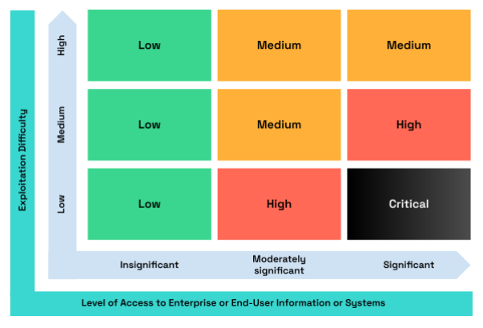

# DVulnDB - Decentralized Vulnerability Database

## 🎯 Project Overview

DVulnDB is a cutting-edge Web3 vulnerability disclosure and bug bounty platform designed specifically for cybersecurity professionals. Built with modern blockchain technologies, it revolutionizes how security researchers discover, report, and monetize vulnerability findings while maintaining transparency and trust through decentralized infrastructure.

## 🚀 Live Prototype

**Access the working prototype:** [DVulnDB Platform](https://ppl-ai-code-interpreter-files.s3.amazonaws.com/web/direct-files/7afffb8dffe5b7608316f81b9689d862/a3b24009-873e-47d4-9583-306f90a2e558/index.html)

## 🎨 Design Philosophy

The platform embraces a terminal/hacker aesthetic that resonates with cybersecurity professionals:

- **Dark theme** with neon green accents (#00ff00)
- **Matrix-style animations** and ASCII art elements  
- **Monospace typography** (JetBrains Mono) for authentic coding feel
- **High contrast design** optimized for long coding sessions
- **Terminal-inspired UI elements** with command-line aesthetics

## 🔧 Core Features

### 1. Wallet Integration

- **Phantom Wallet Integration:** Connect with Phantom wallet for authentication and rewards.
- **Real-time balance tracking** and network status
- **Seamless authentication** through Phantom wallet

### 2. Vulnerability Management

- **Structured vulnerability reporting** with CVSS scoring
- **File upload support** for security tool outputs (Nmap, Nikto, Burp Suite)
- **IPFS integration** for decentralized proof-of-concept storage
- **Status tracking** from submission to disclosure
- **Advanced filtering** by severity, type, and status

### 3. Bug Bounty Ecosystem

- **Smart contract escrow** for secure bounty payments
- **Automatic reward distribution** upon validation
- **Multi-signature validation** requiring community consensus
- **Transparent payment history** and earnings tracking

### 4. Security Researcher Profiles

- **Reputation NFT system** with dynamic visual elements
- **Specialization badges** (Web Security, Network Security, etc.)
- **Portfolio tracking** of discovered vulnerabilities
- **Achievement system** and contribution history
- **Leaderboard rankings** based on impact and accuracy

### 5. Tool Integration Hub

- **PowerShell module** for command-line integration
- **API documentation** for external security tools
- **Sample outputs** and parsing examples
- **Integration guides** for common penetration testing workflows

## 🛠 Technical Architecture

### Frontend Stack

- **Next.js 14** with App Router for modern React development
- **TypeScript** for type-safe development
- **Tailwind CSS** for utility-first styling
- **Web3:** Phantom wallet adapter, Solana web3.js for Web3 blockchain interactions
- **Web3Modal** for wallet connectivity

### Blockchain Integration

- **Smart contract simulation** for vulnerability registry
- **Multi-signature validation** system
- **Bounty escrow mechanisms** with automatic payments
- **Reputation tracking** through blockchain transactions
- **IPFS storage** for vulnerability reports and evidence

### Security Features

- **Encrypted vulnerability storage** with time-locked disclosure
- **Zero-knowledge proofs** for researcher identity verification
- **Multi-party validation** preventing single points of failure
- **Immutable audit trails** for all platform activities

## 🎮 User Journey

### For Security Researchers

1. **Connect wallet** and create researcher profile
2. **Submit vulnerabilities** with detailed PoCs and tool outputs
3. **Track validation progress** through community review
4. **Receive bounty payments** automatically upon confirmation
5. **Build reputation** and unlock higher-tier bounty programs

### For Project Maintainers

1. **Create bounty programs** with defined scope and rewards
2. **Fund escrow contracts** for guaranteed payments
3. **Review submitted vulnerabilities** through the platform
4. **Coordinate with researchers** for responsible disclosure
5. **Track security improvements** and program performance

### For Validators

1. **Stake tokens** to participate in validation network
2. **Review vulnerability submissions** for authenticity
3. **Reproduce security findings** using provided evidence
4. **Vote on bounty eligibility** through consensus mechanism
5. **Earn validation rewards** for accurate assessments

## 🔍 Sample Data Walkthrough

The prototype includes realistic data showcasing:

### Vulnerabilities

- **VLN-2025-001**: Reflected XSS (Severity 7, 500 SOL bounty)
- **VLN-2025-002**: SQL Injection (Severity 9, 1000 SOL bounty)  
- **VLN-2025-003**: IDOR vulnerability (Severity 6, 300 SOL bounty)

### Researchers

- **CyberSecJon**: 850 reputation, Web Security specialist, 23 vulnerabilities found
- **SQLNinja**: 920 reputation, Database Security expert, 31 vulnerabilities found

### Bounty Programs

- **DeFi Protocol X**: 10,000 SOL total pool, smart contract focus
- **Web3 Exchange Pro**: 25,000 SOL pool, trading engine security

## 🛡 Security Tool Integration

### Supported Tools

- **Nmap**: Network discovery and security auditing (XML/JSON output)
- **Nikto**: Web server vulnerability scanning (XML/TXT output)
- **Burp Suite**: Web application security testing (XML/JSON export)
- **Custom PowerShell scripts**: Automated vulnerability scanning

### Integration Examples

```bash
# Nmap Integration
nmap -sS -O target.com -oX output.xml
# Upload output.xml to DVulnDB for automatic parsing

# Nikto Integration  
nikto -h target.com -Format xml -output report.xml
# Import structured vulnerability data

# PowerShell Module
Import-Module DVulnDB
Submit-Vulnerability -Target "example.com" -Type "XSS" -Severity 7
```

## 🎯 ISSessions Community Integration

Perfect for demonstrating at ISSessions events:

### Educational Value

- **Hands-on Web3 security** demonstration
- **Real-world vulnerability examples** from penetration testing
- **Industry-standard tool integration** showcase
- **Responsible disclosure** best practices

### Community Benefits

- **Networking opportunities** through researcher profiles
- **Skill development** in blockchain security
- **Portfolio building** for cybersecurity careers
- **Knowledge sharing** through vulnerability case studies

## 🚀 Future Development Roadmap

## 📈 Standards & Roadmap: CVSS and Blockchain CVEs

DVulnDB is committed to supporting industry-standard vulnerability scoring and next-generation security data storage. The following initiatives are planned:

### CVSS 4.0 & 3.0 Support

- Full support for both CVSS 4.0 and 3.0 scoring systems.
- No proprietary or custom scoring algorithms—only official standards will be used.
- CVSS metrics will be parsed, displayed, and searchable within the platform.

### Blockchain-Native CVE Storage

- Vulnerability records (CVEs) will be stored directly on the blockchain for immutability and transparency.
- CVSS scores and vectors will be stored as part of the on-chain record.
- The platform will not invent its own scoring system; it will leverage existing standards for maximum compatibility and trust.

These features will ensure DVulnDB remains interoperable with the global security ecosystem and trusted by researchers, vendors, and enterprises alike.

## 🔗 Blockchain CVE Severity Scale (Hacken Methodology)

DVulnDB supports blockchain-specific CVEs and severity scoring, following the Hacken methodology as described in [Hacken Pentesting Methodology](https://docs.hacken.io/methodologies/pentesting/#06-severity-scoring-scale). This approach combines exploitation difficulty and access level to determine severity, and maps directly to CVSS for global compatibility.

### Severity Matrix

|                   | Insignificant | Moderately Significant | Significant |
|-------------------|:------------:|:---------------------:|:-----------:|
| **High Difficulty**   | Low          | Medium                | Medium      |
| **Medium Difficulty** | Low          | Medium                | High        |
| **Low Difficulty**    | Low          | High                  | Critical    |

- **Y-axis:** Exploitation Difficulty (High, Medium, Low)
- **X-axis:** Level of Access to Enterprise or End-User Information or Systems (Insignificant, Moderately Significant, Significant)

> 

### Severity Levels and CVSS Mapping

| Severity     | CVSS Range   | Description |
|--------------|--------------|-------------|
| Informational| -            | Does not pose an immediate risk; provides system insights for improvement. |
| Low          | 0.1 - 3.9    | Low risk, low access. Easier to exploit but limited impact. |
| Medium       | 4.0 - 6.9    | Moderate difficulty or access. Greater risk than low, but not severe. |
| High         | 7.0 - 8.9    | Low difficulty, higher access. Significant risk, requires immediate attention. |
| Critical     | 9.0 - 10.0   | Low difficulty, highest access. Most severe, urgent remediation needed. |

**Key Points:**

- DVulnDB will store both the Hacken-style severity and the official CVSS score/vector on-chain.
- No custom scoring will be invented; all mappings use industry standards for maximum transparency and prioritization.
- This ensures blockchain-level CVEs are compatible with global security best practices and easily prioritized by defenders.

### Phase 1: Core Platform (Complete)

- ✅ Web3 wallet integration
- ✅ Vulnerability submission system
- ✅ Basic bounty management
- ✅ Researcher profiles and reputation

### Phase 2: Advanced Features (Planned)

- 🔄 Smart contract deployment on Solana testnet
- 🔄 IPFS integration for decentralized storage
- 🔄 Multi-signature validation implementation
- 🔄 Advanced analytics and reporting

### Phase 3: Enterprise Features (Future)

- 📋 Corporate bounty program management
- 📋 Compliance reporting and audit trails
- 📋 Integration with existing security workflows
- 📋 White-label solutions for organizations

### Phase 4: Ecosystem Expansion (Future)

- 🎯 Cross-chain vulnerability tracking
- 🎯 AI-powered vulnerability assessment
- 🎯 Mobile application for field research
- 🎯 Educational content and certification programs

## 💡 Innovation Highlights

### Blockchain-Native Security

- **First decentralized vulnerability database** eliminating single points of failure
- **Cryptographic proof of contribution** for researchers
- **Immutable security audit trails** for compliance
- **Economic incentive alignment** through cryptocurrency rewards

### Professional Tool Integration

- **Seamless penetration testing workflows** with popular security tools
- **Automated vulnerability classification** using OWASP standards
- **PowerShell module** for Windows environments
- **API-first design** for enterprise integrations

### Community-Driven Validation

- **Multi-party consensus** for vulnerability verification
- **Reputation-based voting** preventing gaming
- **Staking mechanisms** ensuring validator quality
- **Transparent dispute resolution** processes
